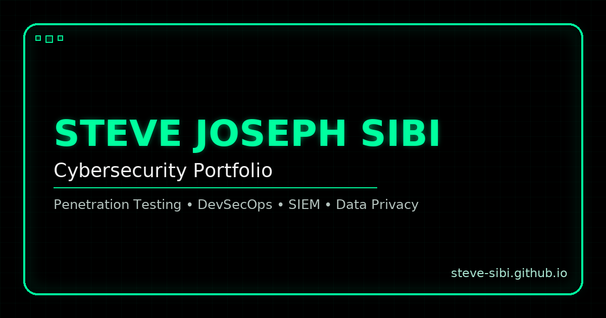

# 🔐 Steve Joseph Sibi - Cybersecurity Portfolio

[](https://steve-sibi.github.io/)
[](LICENSE)

> A modern, data-driven cybersecurity portfolio built with vanilla JavaScript modules, Tailwind CSS 4, and deployed on GitHub Pages.



---

## 🚀 Features

### ✨ Experience-first UI
- **Dark/Light Theme:** toggle updates the sun/moon icon, respects system defaults, and persists in `localStorage`.
- **Hero motion cues:** Typed.js headlines, glitch typography, and IntersectionObserver-driven fade-ins keep the narrative lively without overwhelming users.
- **3D hero terminal:** looping, reduced-motion-aware terminal commands add a hands-on vibe without blocking input.
- **Responsive layout:** sticky sidebar navigation, experience timeline, cards, and tables adapt cleanly across breakpoints.
- **Resume preview modal:** inline PDF viewer with download CTA plus analytics tracking.
- **Bidirectional scroll arrow:** one floating button scrolls down section-by-section and flips to a "back to top" affordance near the footer.

### 🧠 Data & Integrations
- **Projects grid:** pulls from `data/projects.json`, supports tag filters, instant search, alpha sort, and a quick-view modal with repo/readme links plus copy-to-clipboard clone commands.
- **Skills matrix:** builds an accessible table with discipline filters, progress bars, experience tags, and proof links with inline JSON fallback.
- **GitHub activity:** fetches contributions from `github-contributions-api.jogruber.de` when the section enters view, then renders an accessible heatmap plus skeleton/empty states.
- **TryHackMe progress:** configurable stats cards (rank, level, streak, rooms, badges) plus the live profile badge for instant social proof.
- **Contact form workflow:** Web3Forms API + honeypot + inline success/error alerts, with GA events emitted from `js/contact.js`.
- **Social proof:** LinkedIn/GitHub buttons and a resume download CTA are wired into the UI.

### ⚙️ Performance & Accessibility
- **Modular vanilla JS:** discrete feature files share helpers via `utils.js` and gate work behind IntersectionObserver.
- **Lazy vendor loading:** external scripts (Typed.js) load on demand through a cached script loader; contributions API calls and animations stay behind IntersectionObserver triggers.
- **Resilient data:** inline JSON fallbacks for projects and skills keep sections useful even on flaky networks, with skeleton/error states for GitHub activity.
- **Icon subset:** `css/icons.css` preloads a self-hosted, minimal Font Awesome subset to avoid the full library weight.
- **Keyboard-friendly UX:** focus trapping in the mobile drawer and modals, ARIA labels, and semantic tables keep everything screen-reader friendly.
- **Tailwind CLI pipeline:** minified `css/tailwind.css`, preloaded fonts/icons, and a sprinkling of custom CSS deliver speed without a heavyweight build system.

---

## 📋 Table of Contents

- [Quick Start](#-quick-start)
- [Development](#-development)
- [Build & Deploy](#-build--deploy)
- [Project Structure](#-project-structure)
- [Tech Stack](#-tech-stack)
- [Configuration](#-configuration)
- [Customization](#-customization)
- [Performance](#-performance)
- [Browser Support](#-browser-support)
- [Contributing](#-contributing)
- [License](#-license)
- [Contact](#-contact)
- [Acknowledgments](#-acknowledgments)
- [Roadmap](#-roadmap)

---

## ⚡ Quick Start

### Prerequisites
- **Node.js** 18+
- **npm** or **yarn**
- **Python 3** (used by the simple HTTP server)
- A modern browser with JavaScript enabled

### Installation

```bash
# Clone the repository
git clone https://github.com/steve-sibi/steve-sibi.github.io.git
cd steve-sibi.github.io

# Install Tailwind CLI + tooling
npm install

# Optional: build Tailwind once before starting dev work
npm run build:css

# Watch Tailwind and serve the site on http://localhost:8000
npm run dev
```

`npm run dev` spawns the Tailwind watcher and `python3 -m http.server 8000` in the project root. Use `Ctrl+C` to stop both processes. On Windows, run the watcher (`npm run watch:css`) and server (`npm start`) in separate terminals or use WSL.

---

## 🔧 Development

### Available Scripts

| Command | Description |
|---------|-------------|
| `npm run lint` | Syntax-check all JS modules and validate JSON data files |
| `npm run build:css` | Compile and minify `src/tailwind.css` → `css/tailwind.css` for production |
| `npm run watch:css` | Watch Tailwind input and rebuild on every change |
| `npm start` | Serve the site from the repo root via `python3 -m http.server 8000` |
| `npm run dev` | Run the Tailwind watcher and Python server together (POSIX shells) |

### Development Workflow

1. **Start live reload:** `npm run dev`.
2. **Edit content:**
   - Structure & copy: `index.html`
   - Tailwind utilities / design tokens: `src/tailwind.css`
   - Component styles & animations: `css/styles.css`
3. **Update data:** `data/projects.json`, `data/skills.json`, and `assets/Resume_Steve_Sibi_Cyber.pdf`.
4. **Adjust behavior:** edit the relevant file in `js/` (see module table below).
5. **Build CSS** before committing: `npm run build:css`.

### Modular JavaScript

| Module | Responsibility |
|--------|----------------|
| `js/utils.js` | Shared helpers such as `loadExternalScript` and `prefersReducedMotion`. |
| `js/theme.js` | Dark/light mode toggle with ARIA updates and `localStorage` persistence. |
| `js/navigation.js` | Mobile drawer toggling, focus trapping, overlay handling, and active link highlighting. |
| `js/typed-text.js` | Lazy Typed.js integration for the hero text with reduced-motion fallbacks. |
| `js/hero-terminal.js` | 3D hero terminal typing loop with output/history management and reduced-motion fallback. |
| `js/github-calendar.js` | Fetches contributions via `github-contributions-api.jogruber.de`, renders an accessible heatmap, and handles skeleton/error states. |
| `js/tryhackme.js` | Renders TryHackMe stats cards from the configured username and stat counts. |
| `js/skills.js` | Loads skills from `data/skills.json`, renders the table, and drives discipline filters/progress bars. |
| `js/projects.js` | Loads `data/projects.json`, instantiates project cards, and powers filters/search/sort plus the quick-view modal payload. |
| `js/modal.js` | Handles the project quick-view modal, highlight lists, tech pills, and copy-to-clipboard toast notifications. |
| `js/resume-preview.js` | Opens/closes the resume preview modal, injects the PDF iframe source, and fires GA events. |
| `js/contact.js` | Submits the Web3Forms contact form, toggles button states, and shows inline success/error alerts. |
| `js/certifications.js` | Certification flip-card interactions, particle effects, and reduced-motion-friendly entrance animations. |
| `js/scroll-arrow.js` | Controls the bidirectional scroll arrow, including bottom detection and smooth scrolling. |
| `js/animations.js` | Section fade-ins, hero content animation class, resume download tracking, and (optional) email copy helper. |

---

## 📦 Build & Deploy

### Production Build

```bash
npm run build:css
```

This regenerates the minified `css/tailwind.css`. Because the rest of the site is static HTML/JS, no additional bundling is required.

### CI/CD (GitHub Actions)

- Workflow: `.github/workflows/ci.yml`
- Triggers: pushes to `main` and all pull requests
- Steps: `npm ci` → `npm run lint` → `npm run build:css` → upload `css/tailwind.css` as an artifact

### Deploy to GitHub Pages

1. Commit your changes to `main`.
2. Push to GitHub.
3. Ensure GitHub Pages is configured to serve from the repository root (`Settings › Pages`).

GitHub Pages will redeploy automatically after every push.

### Deploy to Other Platforms

#### Netlify

- **Build command**: `npm run build:css`
- **Publish directory**: `./`
- You can keep Netlify on "static" mode; no serverless functions required.

#### Vercel

- **Build command**: `npm run build:css`
- **Output directory**: `./`
- Disable server-side rendering; Vercel just needs to serve the generated static files.

---

## 📁 Project Structure

```
steve-sibi.github.io/
├── assets/
│   └── Resume_Steve_Sibi_Cyber.pdf
├── css/
│   ├── icons.css
│   ├── styles.css
│   └── tailwind.css
├── data/
│   ├── projects.json
│   └── skills.json
├── icons/               # Favicons + PWA manifest
├── images/
│   ├── cert-logos/
│   │   ├── aws.svg
│   │   ├── comptia.svg
│   │   ├── fortinet.svg
│   │   └── icsi.svg
│   ├── og-card.png
│   └── profile_pic_steve.jpg
├── js/
│   ├── animations.js
│   ├── certifications.js
│   ├── contact.js
│   ├── github-calendar.js
│   ├── hero-terminal.js
│   ├── modal.js
│   ├── navigation.js
│   ├── projects.js
│   ├── resume-preview.js
│   ├── scroll-arrow.js
│   ├── skills.js
│   ├── theme.js
│   ├── tryhackme.js
│   ├── typed-text.js
│   └── utils.js
├── src/
│   └── tailwind.css
├── index.html
├── package.json
├── package-lock.json
└── README.md
```

> Additional directories: `.github/` (repository configuration), `.gitignore`, and `node_modules/` (generated after `npm install`).

### Key Files & Directories

| Path | Purpose |
|------|---------|
| `index.html` | Single-page markup, sections, and script loading order. |
| `src/tailwind.css` | Tailwind input plus custom `@theme` tokens. |
| `css/tailwind.css` | Generated (minified) Tailwind output - do not edit directly. |
| `css/styles.css` | Handwritten component styles, timelines, and animations. |
| `css/icons.css` | Minimal Font Awesome subset with preloads to keep icons lightweight. |
| `data/projects.json` | Source of truth for the projects grid. |
| `data/skills.json` | Source of truth for the skills matrix. |
| `assets/Resume_Steve_Sibi_Cyber.pdf` | Resume served inside the preview modal and download button. |
| `icons/` | All favicons and `site.webmanifest`. |
| `images/og-card.png` | Open Graph / social preview image referenced in `<head>`. |
| `images/cert-logos/` | Certification logos used in the cards and progress tiles. |
| `js/*.js` | Feature-specific JavaScript modules, including the GitHub contributions fetcher, TryHackMe stats, hero terminal, and UI helpers. |
| `.github/` | GitHub workflows and documentation helpers (e.g., Copilot instructions). |

---

## 🛠️ Tech Stack

### Core Technologies
- **HTML5** with semantic sections, ARIA labels, and skip links.
- **Tailwind CSS 4** (via CLI) plus custom CSS for timelines, pills, and modals.
- **Vanilla JavaScript (ES6)** split into focused modules; no bundler required.
- **GitHub Pages** for hosting and HTTPS.

### Libraries & APIs

| Library / API | Purpose | Version |
|---------------|---------|---------|
| [Tailwind CSS](https://tailwindcss.com/) | Utility-first styling & theming | 4.1.13 (CLI) |
| [Font Awesome](https://fontawesome.com/) | Icon subset (preloaded fonts via CDN) | 6.5.1 |
| [Typed.js](https://github.com/mattboldt/typed.js) | Hero typing animation | 2.0.12 |
| [GitHub Contributions API](https://github-contributions-api.jogruber.de/) | JSON feed for the contributions heatmap | v4 API |
| [Web3Forms](https://web3forms.com/) | Contact form backend | API |
| [Google Analytics 4](https://marketingplatform.google.com/about/analytics/) | Analytics & event tracking | `gtag.js` |

### Development Utilities
- **@tailwindcss/cli** for compilation.
- **Python 3 `http.server`** as the lightweight dev server.
- **npm scripts** to orchestrate watch/build tasks.
- **Lighthouse / browser devtools** for performance checks.

---

## ⚙️ Configuration

### Tailwind Theme

`src/tailwind.css` contains Tailwind 4's inline configuration. Update tokens and layers there, then rebuild.

```css
@import "tailwindcss";

@theme {
  --color-cyber-green: #10b981;
  --color-cyber-dark: #0a0e27;
  --font-family-sans: "Share Tech Mono", system-ui, sans-serif;
  /* Add tokens here */
}
```

### Analytics (GA4)

Replace `G-F499NLV8V2` with your GA4 Measurement ID near the top of `index.html`.

```html
<script async src="https://www.googletagmanager.com/gtag/js?id=G-F499NLV8V2"></script>
<script>
  window.dataLayer = window.dataLayer || [];
  function gtag(){dataLayer.push(arguments);}
  gtag('js', new Date());
  gtag('config', 'G-F499NLV8V2');
</script>
```

### Contact Form (Web3Forms)

Update your access key and redirect URL inside the contact form in `index.html`.

```html
<form id="contactForm" action="https://api.web3forms.com/submit" method="POST">
  <input type="hidden" name="access_key" value="YOUR-ACCESS-KEY">
  <input type="hidden" name="redirect" value="https://steve-sibi.github.io/#contact">
  <input type="checkbox" name="botcheck" class="hidden">
  <!-- ... -->
</form>
```

### GitHub Contributions Username

`js/github-calendar.js` pulls from `https://github-contributions-api.jogruber.de/v4/`. Update the username constant to your GitHub handle:

```javascript
const USERNAME = 'steve-sibi';
```

### Hero Typed Headlines

Edit the strings array in `js/typed-text.js` to change the rotating hero skills.

```javascript
new Typed('#typed-text', {
  strings: [
    'Data Privacy &amp; Encryption',
    'Network Security',
    'Cloud Security'
    // ...
  ],
  loop: true
});
```

### Hero Terminal Commands

Update the command/output loop in `js/hero-terminal.js` to match the stories you want to tell:

```javascript
const commandSequences = [
  {
    command: 'nmap -sV 192.168.1.0/24',
    output: ['Starting Nmap scan...', 'Discovered open services', 'Scan complete: 24 hosts up'],
    type: 'success'
  },
  // ...
];
```
The module trims history automatically and falls back to static output when `prefers-reduced-motion` is enabled.

### Resume Preview

`js/resume-preview.js` points to `assets/Resume_Steve_Sibi_Cyber.pdf`. Swap the file or update the path:

```javascript
const resumePath = 'assets/Resume_Steve_Sibi_Cyber.pdf';
```

Remember to update the download link in `index.html` too.

### TryHackMe Stats & Badge

`js/tryhackme.js` drives the stats grid. Update the username and numbers there:

```javascript
const THM_USERNAME = 'DankKnight';
const userStats = {
  rank: '7%',
  level: 8,
  streak: 45,
  roomsCompleted: 59,
  badgesEarned: 10,
  userRank: 'Top 7%'
};
```
The badge image and profile link live in the `#tryhackme` section of `index.html`; swap the handle/URL if you change users.

### Certifications & Progress Cards

Cert flip cards are defined under `#certifications` in `index.html` using logos from `images/cert-logos/`. Update titles, issuers, verification URLs, and skill bullets inline. Progress targets and percentages for in-progress certs live in `#certifications-in-progress`; adjust the text and inline widths together.

---

## 🎨 Customization

### Projects (`data/projects.json`)

Add or edit projects using the extended schema below. Optional fields (`pillTech`, `readme`, `clone`) enrich the quick-view modal.

```json
{
  "id": "mini-saas-ato",
  "title": "Account Takeover (ATO) Detection and Response",
  "description": "Production-style ATO simulation lab with Flask, Datadog, and Azure Functions.",
  "icon": "fas fa-user-secret",
  "tags": ["security", "cloud", "automation"],
  "pillTech": ["Python", "Flask", "Datadog", "Azure"],
  "tech": ["Python", "Flask", "Datadog", "Azure Functions", "Signed Webhooks"],
  "link": "https://github.com/steve-sibi/mini-saas-ato",
  "readme": "https://github.com/steve-sibi/mini-saas-ato#readme",
  "clone": "https://github.com/steve-sibi/mini-saas-ato.git",
  "highlights": [
    "Detects brute-force & credential-stuffing with Datadog pipelines",
    "Signed webhooks + Azure Functions invalidate sessions in seconds"
  ]
}
```

- Buttons in the UI filter by `tags` (lowercase is safest).
- The quick-view modal lists `highlights` and renders tech pills from `tech`.
- If you omit `readme` or `clone`, defaults are derived from `link`.

### Skills (`data/skills.json`)

Each skill entry powers a row in the table.

```json
{
  "name": "Nmap",
  "cat": "cyber",
  "level": 90,
  "years": 5,
  "proof": "https://github.com/steve-sibi/Automated-Vulnerability-Scanner"
}
```

- `cat` drives the discipline filters (`cyber`, `prog`, `os`, `cloud`, `other`).
- `level` should be 0-100. Missing values display `-`.
- `proof` is optional but recommended for credibility.

### Assets & Visuals

- Replace `assets/Resume_Steve_Sibi_Cyber.pdf` with your own resume (keep the filename or update references).
- Update `images/og-card.png` to refresh the Open Graph preview.
- Favicons and manifest live under `icons/`; regenerate with a favicon generator if you change branding.

---

## ⚡ Performance

Built-in optimizations:

- **Lazy execution** via IntersectionObserver for Typed.js, GitHub contributions fetch/render, scroll arrow state, and fade-in animations.
- **Dynamic script loader** caches vendor scripts (Typed.js) to prevent duplicate downloads.
- **Reduced motion support** swaps hero effects (typed text, 3D terminal, particles) for static output when users prefer less motion.
- **Lightweight tooling** because only Tailwind CLI runs at build time; everything else is static assets.
- **Minimized layout shift** with pre-sized images (TryHackMe badge, OG card) and preloaded Font Awesome subset fonts.

Before publishing, run your own Lighthouse audits to validate Core Web Vitals for your hardware/network.

---

## 🌐 Browser Support

| Browser | Minimum Version | Notes |
|---------|----------------|-------|
| Chrome | 90+ | IntersectionObserver + CSS custom properties required. |
| Firefox | 88+ | Tested with reduced-motion preference. |
| Safari | 14+ | Works with WebKit's `prefers-color-scheme`. |
| Edge | 90+ | Chromium-based Edge supports all required APIs. |

The experience relies on `fetch`, `IntersectionObserver`, CSS Grid/Flexbox, and `localStorage`.

---

## 🤝 Contributing

This is a personal portfolio, but suggestions and issues are welcome.

1. **Fork** the repo.
2. **Create** a feature branch (`git checkout -b feature/amazing-feature`).
3. **Commit** with clear messages (`git commit -m "Add amazing feature"`).
4. **Push** your branch (`git push origin feature/amazing-feature`).
5. **Open** a Pull Request.

### Development Guidelines
- Follow the modular JavaScript pattern (one concern per file).
- Update or add data (`data/*.json`) instead of hard-coding content in HTML when possible.
- Test across light/dark modes and multiple breakpoints.
- Keep dependencies minimal; prefer native browser APIs.
- Document major UI or data changes inside this README.

---

## 📝 License

This project is licensed under the **ISC License**.

Copyright © 2025 Steve Joseph Sibi

Permission to use, copy, modify, and/or distribute this software for any purpose with or without fee is hereby granted, provided that the above copyright notice and this permission notice appear in all copies.

---

## 📬 Contact

**Steve Joseph Sibi**  
Cybersecurity Engineer · Penetration Tester · Privacy Advocate

- 🌐 Website: [steve-sibi.github.io](https://steve-sibi.github.io/)
- 💼 LinkedIn: [steve-sibi](https://www.linkedin.com/in/steve-sibi)
- 🐙 GitHub: [@steve-sibi](https://github.com/steve-sibi)
- 📧 Email: steve.sibi@gmail.com

---

## 🙏 Acknowledgments

- Icons by [Font Awesome](https://fontawesome.com/)
- Fonts by [Google Fonts](https://fonts.google.com/)
- Typing effect by [Typed.js](https://github.com/mattboldt/typed.js/)
- GitHub heatmap data by [github-contributions-api](https://github-contributions-api.jogruber.de/)
- Form backend by [Web3Forms](https://web3forms.com/)
- Hosting by [GitHub Pages](https://pages.github.com/)

---

## 🗺️ Roadmap

### ✅ Completed
- [x] Modularized JavaScript architecture
- [x] Project quick-view modal with copy-to-clipboard support
- [x] Resume preview modal with analytics events
- [x] Web3Forms-powered contact form with inline alerts
- [x] Bidirectional scroll arrow and section fade-in animations
- [x] Lazy-loaded GitHub activity and Typed.js hero text
- [x] Font Awesome subset loading (self-hosted icons)
- [x] GitHub Actions CI/CD for linting + CSS builds

### 🚧 In Progress
- [ ] Enhanced project screenshots / media slots

### 📅 Planned
- [ ] Automated image optimization pipeline
- [ ] Progressive Web App enhancements